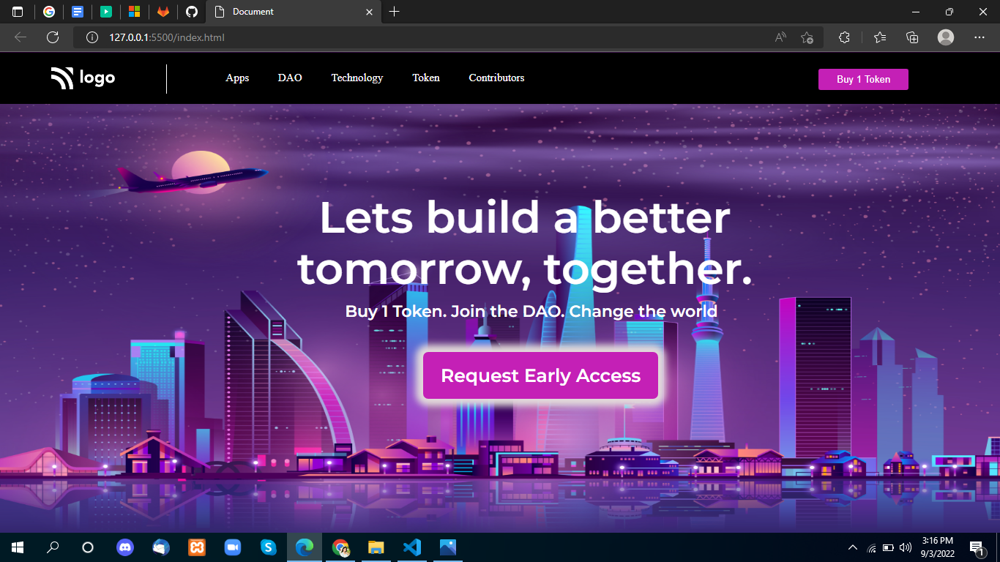

# Project-5

 

## Project live link
[https://my-project-05.netlify.app/](https://my-project-05.netlify.app/ "project05")

## Screenshot

 

## project Type
- UI Design
- One Page Website

## My learning from this Project
- Background Position
- How to design HTML Code
- Button Degining
- Hover effect
- shadow effect on button

## Time to make this project
#### Approx 3 hour to make this project
